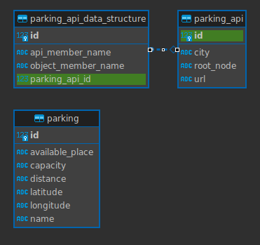
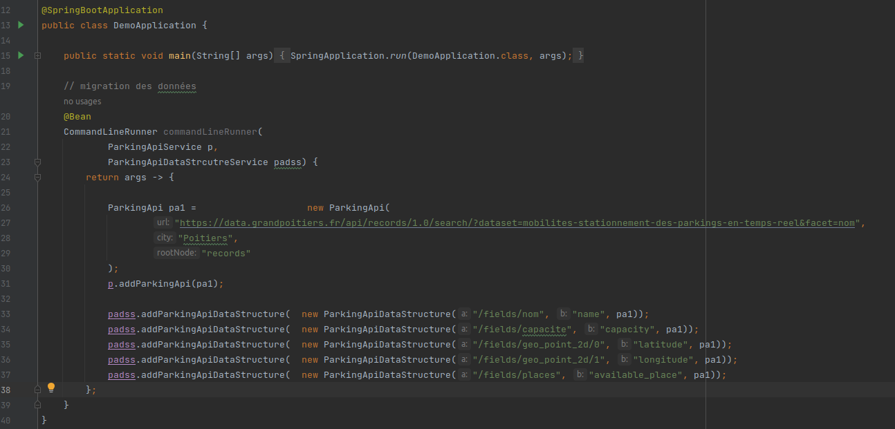
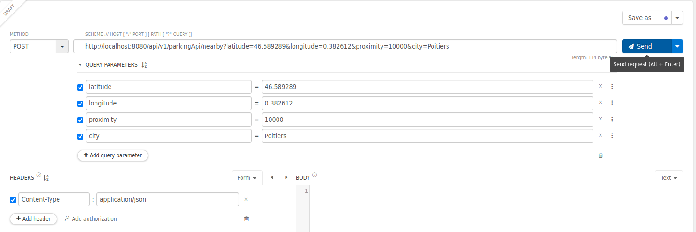
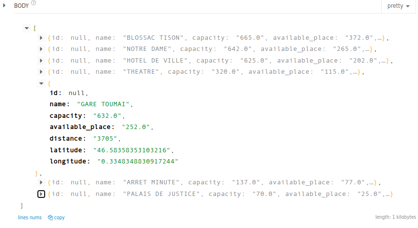

# 1. Analyse et Conception
Cette section décrit les diverses étapes qui ont été suivies pour résoudre ce problème.
L'objectif du projet est de créer une application serveur qui propose une API REST pour permettre à une application mobile ou à un site web d'afficher la liste des parkings à proximité.
Il est nécessaire de respecter les directives suivantes :

L'application devrait être capable de fonctionner dans différentes villes. L'URL et le format des données du parking peuvent donc varier. Cependant, l'API REST exposée à l'application mobile ne devrait pas subir de changements.
## 1.1. Conception:
Pour répondre à ces exigences, j'ai conçu un mappeur de fichiers JSON et la classe Parking qui contiendra toutes les informations nécessaires.
Voici la modélisation proposée:

### - Table parking :
Elle contient les champs suivants : 
<ul>
    <li>id : identifiant du parking.</li>
<li>available_place : le nombre de places disponibles.</li>
<li>capacity : la capacité du parking.</li>
<li>distance : La distance entre le parking et l'emplacement actuel de l'utilisateur qui a envoyé la requête POST. 
</li>
<li>latitude, longitude : sont les coordonnées GPS du parking.</li>
<li>name : le nom du parking.</li>
</ul>

### - Table parking_api :
C'est la table qui va stocker les liens des API de parking de chaque ville. Elle contient les champs suivants :
<ul>
    <li>id : identifiant.</li>
<li>city : le nom de ville.</li>
<li>url : le lien de l'API.</li>
<li>root_node :Le noeud racine qui contient les informations nécessaires pour créer nos objets "Parking". Par exemple, dans notre cas, le root_node est "records". 
</li>

</ul>

### - Table parking_api_data_structure :
C'est la table qui va stocker la correspondance entre l'objet "Parking" et la réponse de l'API. Elle contient les champs suivants :
<ul>
    <li>id : identifiant.</li>
<li>api_member_name : le chemin du champ dans la réponse json. Exemple, api_member_name:"/fields/nom"</li>
<li>Object_member_name : le nom de l'attribut dans la classe Parking.Exemple, Object_member_name:"name"</li>
<li>parking_api_id : clé étrangère vers la table parking_api. 
</li>

</ul>

## 1.2. Choix technique:

J'ai opté pour l'implémentation de cette fonctionnalité en utilisant le framework Spring et une base de données PostgreSQL.
# 2. Lancement du programme:
Afin de démarrer correctement le programme, vous devez modifier les paramètres de connexion à la base de données dans le fichier situé à l'emplacement suivant : <b>src/main/resources/application.properties</b>
 

Concernant la migration des données, elle est déjà prise en charge au sein de la classe "DemoApplication".
 
Vous devez vous authentifier avant d'exploiter les fonctionnalités,
 
url of login : localgost:8080/api/v1/login
 
username : abde53
 
password : password
 
Ensuite vous devez ajouter au header  
Authorization : Bearer ${token}
# 3. Résultats
API Post qui permet de retourner les parking à proximité, accepte les paramètres suivantes:
<ul>
<li>latitude (double)</li>
<li>longitude (double)</li>
<li>proximity (int) : le rayon de proximité en metre</li>
<li>city (string) :  le nom de la ville dans laquelle la recherche est effectuée.</li>

</ul>
Si vous exécutez le programme sur localhost, l'URL de l'API sera : <b>http://localhost:8080/api/v1/parkingApi/nearby</b>

J'ai utilsé une extension de chrome qui s'appelle <b>Talend API Tester</b> pour tester l'API.

Voici un exemple de résultat obtenu :

# 4. Points non traités:
Pour simplifier la tâche, j'ai considéré tous les attributs de la classe Parking comme des chaînes de caractères pour faciliter leur récupération. Nous pourrions ajouter un autre champ dans la table parking_api_data_structure qui contiendrait le type de l'attribut dans la classe, comme Integer, Double, Long, etc.

J'ai également remarqué que l'API accepte des paramètres. Nous pourrions donc ajouter une autre table liée à ParkingApi, qui contiendrait le nom du paramètre avec sa valeur par défaut.  